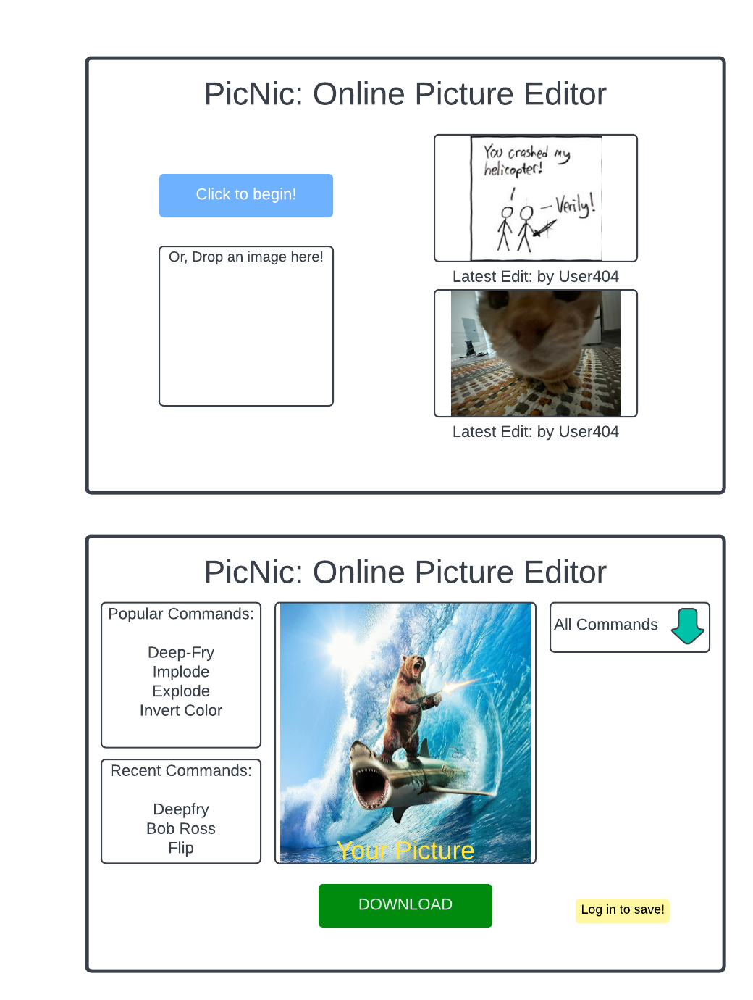

# startup

### Test for GitHub Assignment
first modification!s
second modification!s

I first of all learned that I had Visual Studio and not VS Code. So I learned the most about how to use VS Code. I also learned the order of the merge resolver, which explains why the '!' came before the 's' in my resolution.

## Product Pitch!

When I was younger, we had a Discord bot that would take a picture and a command and return an edited, funnier picture. The bot has been shut down for ages, but I want to revive the service with my website. My website will be easy to use and feature plenty of funny ways to edit photos without any of the effort. It will be the most convenient meme creator out there.

Rough Designs:

###### Notes from starting a server
ip - 52.15.102.216
how to ssh - ssh -i [key pair file] ubuntu@[ip address]
I went into someone else's computer for the first time. Felt a little something. That's all. Still so much I don't know.

###### Notes from naming an IP
Feels a lot cooler, I've now got a website with a url. A lot easier to understand too.

###### Notes from HTML with Simon
It's scary how easy we can do things if we have the permissions file. Glad we were quickly instructed to keep it safe.
Referencing other HTML pages is as easy as the href call, makes linking pages on a site make much more sense.

#### Push 1
Added three html files and a CSS. Created framework for the home page and the header for all three.

#### Push 2
Framework for about page.

#### Push 3
Footer

#### Push 4
Create page HTML done.

### Deploy 1
HTML Structure Upload

#### Push 5
Flex CSS implemented

#### Push 6
Fonts imported, some boostrap enabled, like navbar. Figuring out bootstrap is the hardest part right now.

#### Push 7
Redoing concept, new HTML done and some css

#### Push 8
Got the JS username working, and Log In/Log Out working. Super proud.

### Deploy 2...?
New HTML, CSS, and the JS login stuff.

#### Push 9
Added search JS and the base table code.

#### Push 10
Created a simple mock spell library, loaded it into the table.

#### Push 11
implemented regex filtering on the search table, now I just need a searched parameter.

#### Push 12
Added names and login/out to the search page

#### Push 13
Finalized searching on the search page. Added a footer with the GitHub link to the home and search pages.

#### Push 14
Added home button on search page

#### Push 15
Removed searching from home page until there is time to implement fully.

### Deploy 3
Finished the searching part, uploading with a small array of spells

#### Push 16
Added the index.js file, and enabled it to work with endpoints. Backend is now functional. Time to put more in.

#### Push 17
Base DB functionality enabled, it reaches Mongo and returns to service. Only getAllSpells done, sorting is still frontend.

### Deploy 4
Node.js working, Mongo working

#### Push 18
Authentication working, mostly copied over from Simon, and mostly understood.

### Deploy 5
Working authentication, totally was not testing on my production environment.